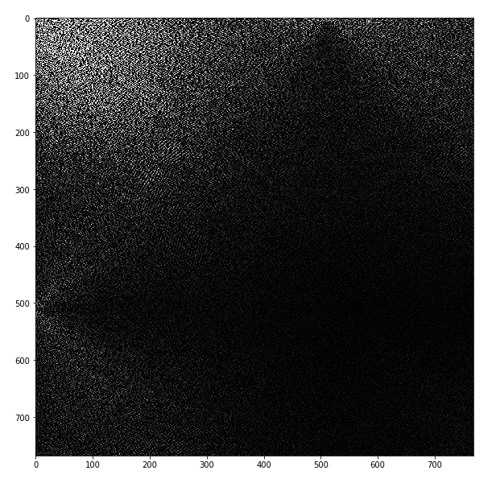

# How to determine the original resolution of an upscale image?

## Objective 
The objective of this notebook is to divulgate a general method of finding the original resolution of an upscale image or video. I will try to show you with images.

## The story
A friend told me that it was possible to determine the original resolution of an upscale image or video with the DCT (Discrete Cosine Transform), I then searched the web and found the following github project that did exactly that.
[GitHub - 0x09 – resdet - Detect source resolution of upscaled images](https://github.com/0x09/resdet)  

 
In it is written **how it works:**  
 
“How?  
Traditional resampling methods tend to manifest as an odd extension of a signal's frequency domain combined with a low-pass filter (where the shape of the filter differs among the various resampling methods). Conveniently the Discrete Cosine Transform causes the zero-crossings of this extension to fall at exactly the offset the source was upscale from  resdet works by trying to identify these inversions.” 
 
I found the explanation very simple but then when I read the source code I have found it really complex for such a simple description, but it is a full blown program that is made for fast execution and supporting images and videos. 
 
So I started to implement a simple version just to play with the concept and come up with a different and simple implementation not in C but in Python and with a simpler detection method that I document here with pictures.

## The method used
My simple detection method is to just sum the absolute values of each row and each column and find the lower ones. My method like the method described in the above project 0x09/resdet, works best with uncompressed images that are then upscale.

## Please click on the notebook file to see a visual explanation of the algorithm
[Notebook](./original_resolution_of_upscalled_image.ipynb)

## Image of the 2D DCT transform see the row and column 512 of this 768 upscale image

## Requirements
* NumPy
* SciPy
* Pillow

## References
* [GitHub - 0x09 – resdet - Detect source resolution of upscale images](https://github.com/0x09/resdet)
* [Docs of imageio](https://imageio.readthedocs.io/en/stable/examples.html)
* [Using the SciPy DCT function to create a 2D DCT-II](https://stackoverflow.com/questions/15978468/using-the-scipy-dct-function-to-create-a-2d-dct-ii)
* [Numpy Resize/Rescale Image](https://stackoverflow.com/questions/48121916/numpy-resize-rescale-image)

## License
MIT Open Source

## Have fun!
Best regards,  
Joao Nuno Carvalho